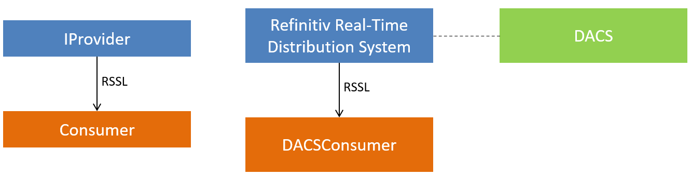
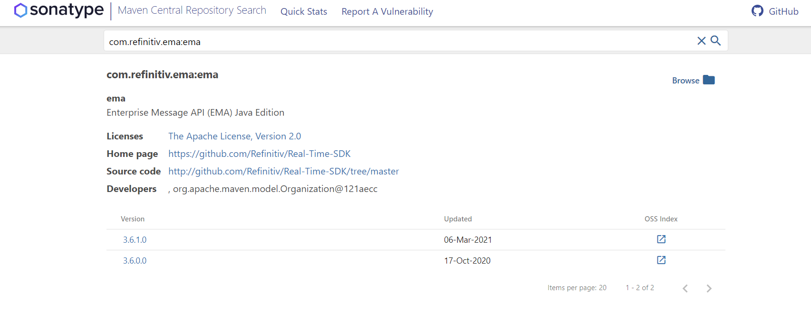
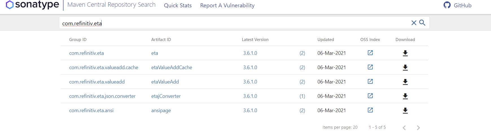
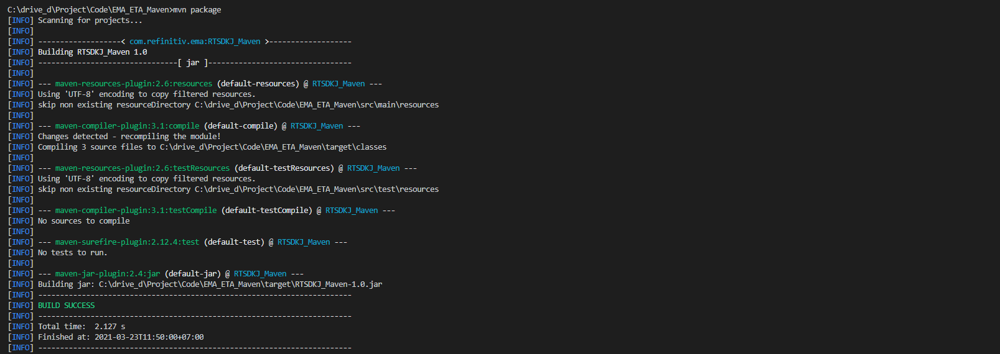

# Set Up Refinitiv Real-Time SDK Java Application with Maven

## Overview


[Refinitiv Real-Time SDK (Java Edition)](https://developers.refinitiv.com/en/api-catalog/elektron/elektron-sdk-java) (RTSDK, formerly known as Elektron SDK) is a suite of modern and open source APIs that aim to simplify development through a strong focus on ease of use and standardized access to a broad set of Refinitiv proprietary content and services via the proprietary TCP connection named RSSL and proprietary binary message encoding format named OMM Message. The capabilities range from low latency/high-performance APIs right through to simple streaming Web APIs. 

The SDK has been mavenized to support [Apache Maven](https://maven.apache.org/) and [Gradle](https://gradle.org/) build automation tools since Refinitiv Real-Time SDK (RTSDK) Java (formerly known as Elektron SDK) version 1.2. This supported helps Java developers to build RTSDK Java application, manage its dependencies (Java Developers do not need to manual manage different versions of jar files anymore), and better collaboration in the team.

This example project shows how to create the RTSDK - Java project with a simple Maven configuration. The project also shows how to use Maven with a 3rd-party jar file that is not in the public Maven repository.

The example applications diagram is the following:




## IMPORTANT Rebranding Announcement: 

Starting with version RTSDK 2.0.0.L1 (same as EMA/ETA 3.6.0.L1), there are namespace changes and library name changes. Please note that all interfaces remain the same as prior releases of RTSDK and Elektron SDK and will remain fully wire compatible. Along with RTSDK 2.X version, a [REBRAND.md](https://github.com/Refinitiv/Real-Time-SDK/blob/master/REBRAND.md) is published to detail impact to existing applications and how to quickly adapt to the re-branded libraries. Existing applications will continue to work indefinitely as-is.  Applications should be proactively rebranded to be able to utilize new features, security updates or fixes post 2.X release. Please see [PCN](https://my.refinitiv.com/content/mytr/en/pcnpage/12072.html?_ga=2.103280071.632863608.1606731450-325683966.1598503157) for more details on support. 

## RTSDK Java with Gradle

RTSDK - Java package comes with Gradle build tool supported by default, please find more detail in [RTSDK Java Build System page](https://developers.refinitiv.com/en/api-catalog/elektron/elektron-sdk-java/quick-start#rtsdk-build-system) and RTSDK - Java's README file. You can download the SDK package from [Developer Portal website](https://developers.refinitiv.com/en/api-catalog/elektron/elektron-sdk-java/download) and [GitHub repository](https://github.com/Refinitiv/Real-Time-SDK).

## RTSDK Java Maven Repository

The Refinitiv Real-Time SDK Java is now available in [Maven Central Repository](https://search.maven.org/). You can define the following dependency in Maven's pom.xml file to let Maven automatically download the [EMA Java library](https://search.maven.org/artifact/com.refinitiv.ema/ema/) and [ETA Java library](https://search.maven.org/artifact/com.refinitiv.eta/eta) for the application.





Note: 
- This article is based on EMA Java version 3.6.1 L1 (RTSDK Java Edition 2.0.1 L1). 


### Maven pom.xml setting for EMA Java

The ```pom.xml``` file the main Maven's project configuration. This XML file contains the information required to build a project.

```
<?xml version="1.0" encoding="UTF-8"?>

<project xmlns="http://maven.apache.org/POM/4.0.0" xmlns:xsi="http://www.w3.org/2001/XMLSchema-instance"
         xsi:schemaLocation="http://maven.apache.org/POM/4.0.0 http://maven.apache.org/xsd/maven-4.0.0.xsd">
    <modelVersion>4.0.0</modelVersion>

    <groupId>com.refinitiv.ema</groupId>
    <artifactId>RTSDKJ_Maven</artifactId>
    <version>1.0</version>

    ...

</project>
```

The brief information of each POM file elements are the following:
- project: The top-level element in all Maven pom.xml files.
- groupId: This element indicates the unique identifier of the organization or group that created the project. 
- artifactId: This element indicates the unique base name of the primary artifact being generated by this project. 
- version: This element indicates the version of the artifact generated by the project. 

Please see more detail on the [Maven Quick Start page](https://maven.apache.org/guides/getting-started/) for a full explanation of the POM essentials elements. 

You can specify the following EMA Java application dependencies in the Maven pom.xml file. The EMA Java is the message-level API built on top of the ETA Java (Transport API), so the application needs ETA libraries too.

Please notice that I use the  [Maven variables](https://maven.apache.org/guides/introduction/introduction-to-the-pom.html#project-interpolation-and-variables) ```<rtsdk.version>3.6.1.0</rtsdk.version>``` to set the library version in a single place in the pom.xml file.

```
<project xmlns="http://maven.apache.org/POM/4.0.0" xmlns:xsi="http://www.w3.org/2001/XMLSchema-instance"
         xsi:schemaLocation="http://maven.apache.org/POM/4.0.0 http://maven.apache.org/xsd/maven-4.0.0.xsd">
    <modelVersion>4.0.0</modelVersion>
    ...
<properties>
    <project.build.sourceEncoding>UTF-8</project.build.sourceEncoding>
    <maven.compiler.source>1.8</maven.compiler.source>
    <maven.compiler.target>1.8</maven.compiler.target>
    <rtsdk.version>3.6.1.0</rtsdk.version>
</properties>

    <dependencies>
        <!-- RTSDK -->
        <dependency>
            <groupId>com.refinitiv.ema</groupId>
            <artifactId>ema</artifactId>
            <version>${rtsdk.version}</version>
        </dependency>
        <dependency>
            <groupId>com.refinitiv.eta</groupId>
            <artifactId>eta</artifactId>
            <version>${rtsdk.version}</version>
        </dependency>
        <dependency>
            <groupId>com.refinitiv.eta.valueadd</groupId>
            <artifactId>etaValueAdd</artifactId>
            <version>${rtsdk.version}</version>
        </dependency>
        <dependency>
            <groupId>com.refinitiv.eta.valueadd.cache</groupId>
            <artifactId>etaValueAddCache</artifactId>
            <version>${rtsdk.version}</version>
        </dependency>
        <dependency>
            <groupId>com.refinitiv.eta.ansi</groupId>
            <artifactId>ansipage</artifactId>
            <version>${rtsdk.version}</version>
        </dependency>
    </dependencies>
</project>
```

### Maven pom.xml setting for ETA Java

The pom.xml file for the ETA Java application is similar to the EMA Java application except you do not need to declare EMA dependency. 

```
<project xmlns="http://maven.apache.org/POM/4.0.0" xmlns:xsi="http://www.w3.org/2001/XMLSchema-instance"
         xsi:schemaLocation="http://maven.apache.org/POM/4.0.0 http://maven.apache.org/xsd/maven-4.0.0.xsd">
    <modelVersion>4.0.0</modelVersion>
    ...
    <properties>
        <project.build.sourceEncoding>UTF-8</project.build.sourceEncoding>
        <maven.compiler.source>1.8</maven.compiler.source>
        <maven.compiler.target>1.8</maven.compiler.target>
        <rtsdk.version>3.6.1.0</rtsdk.version>
    </properties>

    <dependencies>
        <!-- RTSDK -->
        <dependency>
            <groupId>com.refinitiv.eta</groupId>
            <artifactId>eta</artifactId>
            <version>${rtsdk.version}</version>
        </dependency>
        <dependency>
            <groupId>com.refinitiv.eta.valueadd</groupId>
            <artifactId>etaValueAdd</artifactId>
            <version>${rtsdk.version}</version>
        </dependency>
        <dependency>
            <groupId>com.refinitiv.eta.valueadd.cache</groupId>
            <artifactId>etaValueAddCache</artifactId>
            <version>${rtsdk.version}</version>
        </dependency>
        <dependency>
            <groupId>com.refinitiv.eta.ansi</groupId>
            <artifactId>ansipage</artifactId>
            <version>${rtsdk.version}</version>
        </dependency>
    </dependencies>
</project>
```

### Maven pom.xml setting for non-Maven Jar File

If the project requires the local jar file that not yet part of the public [Maven repository](https://search.maven.org/), you can use [Maven Install Plugin](https://maven.apache.org/guides/mini/guide-3rd-party-jars-local.html) to install a JAR in the local Maven repository with the following command.

```
mvn install:install-file -Dfile=<path-to-file> -DgroupId=<group-id> -DartifactId=<artifact-id> -Dversion=<version> -Dpackaging=<packaging>
```

This project uses [Refinitiv Robust Foundation API (RFA) - Java](https://developers.refinitiv.com/en/api-catalog/thomson-reuters-enterprise-platform/robust-foundation-api-rfa-java) as an example non-Maven jar file. The *DACSConsumer* example application consumes real-time data from Refinitiv Real-Time Distribution Server and then uses ```com.reuters.rfa.dacs``` package to extract the Permission information from incoming data.

ํYou can install the *rfa.jar* file to the local Maven repository with the following command

```
mvn install:install-file -Dfile="C:\rfaj820L2\Libs\rfa.jar" -DgroupId=com.reuters.rfa -DartifactId=rfa -Dversion=8.2.0.2 -Dpackaging=jar -DgeneratePom=true
```

Then, all Maven projects in the same machine can use RFA Java by declaring the dependency the Maven pom.xml file.

```
<project xmlns="http://maven.apache.org/POM/4.0.0" xmlns:xsi="http://www.w3.org/2001/XMLSchema-instance"
         xsi:schemaLocation="http://maven.apache.org/POM/4.0.0 http://maven.apache.org/xsd/maven-4.0.0.xsd">
    <modelVersion>4.0.0</modelVersion>
    ...
    <dependencies>
        <!-- rfa -->
        <dependency>
            <groupId>com.reuters.rfa</groupId>
            <artifactId>rfa</artifactId>
            <version>8.2.0.2</version>
        </dependency>
    </dependencies>
</project>
```

If you are interested to set your internal Maven repository for your team, please refer to [Introduction to Repositories guide](https://maven.apache.org/guides/introduction/introduction-to-repositories.html) and [How to set up and use a JFrog Artifactory as a local Maven repository](https://www.theserverside.com/video/How-to-set-up-and-use-a-JFrog-Artifactory-Maven-repository) page.

### Building the project

You can run the Maven ```mvn package``` command to compile all applications in the Maven project and build the applications jar file. The class and jar files will be available in the *target* folder by default.



However, this newly built jar file contains only the application class files, so you need to set the Java classpath to all required RTSDK jar files which store somewhere in your Maven repository folder to run this jar file. To avoid this problem, you can use the Maven [Assembly Plugin](http://maven.apache.org/plugins/maven-assembly-plugin/) to build the project and RTSDK library into a single-all-dependencies jar file in the project's *target* folder.

```
<project xmlns="http://maven.apache.org/POM/4.0.0" xmlns:xsi="http://www.w3.org/2001/XMLSchema-instance"
         xsi:schemaLocation="http://maven.apache.org/POM/4.0.0 http://maven.apache.org/xsd/maven-4.0.0.xsd">
    <modelVersion>4.0.0</modelVersion>
    ...
    <build>
    <plugins>
        <plugin>
            <groupId>org.apache.maven.plugins</groupId>
            <artifactId>maven-assembly-plugin</artifactId>
            <executions>
                <execution>
                <phase>package</phase>
                <goals>
                    <goal>single</goal>
                </goals>
                <configuration>
                    <archive>
                        <manifest>
                            <mainClass>com.refinitiv.ema.consumer.Consumer</mainClass>
                        </manifest>
                    </archive>
                    <descriptorRefs>
                        <descriptorRef>jar-with-dependencies</descriptorRef>
                    </descriptorRefs>
                </configuration>
                </execution>
            </executions>
        </plugin>
    </plugins>
    </build>
</project>
```

Once you run the Maven ```mvn package``` command, Maven will build a single-all-dependencies jar file named *RTSDKJ_Maven-1.0-jar-with-dependencies.jar* in the *target* folder. 

Please check [Running Maven Tools page](https://maven.apache.org/guides/getting-started/maven-in-five-minutes.html#running-maven-tools) for more detail about other useful Maven commands.

### Demo prerequisite
This example requires the following dependencies software and libraries.
1. Oracle/Open JDK 8 or Oracle JDK 11.
2. [Apache Maven](https://maven.apache.org/) project management and comprehension tool.
3. Internet connection. 
4. Refinitiv Real-Time Distribution System with Refinitiv Data Access Control System (DACS) for the *DACSConsumer.java* example. 

*Note:* 
The RTSDK Java version 2.0.1 L1 (EMA Java 3.6.1) supports Oracle JDK versions 8, 11, and Open JDK version 8. If you are using other versions of RTSDK Java, please check the SDK's [README.md](https://github.com/Refinitiv/Real-Time-SDK/blob/master/Java/README.md) file regarding the supported Java version.

### Running the demo applications

If your environment does not have the Maven installed, please follow the [Maven installation guide page](https://maven.apache.org/install.html) for more detail.

#### Running IProvider and Consumer applications

Firstly, open the project folder in the command prompt and then run the IProvider example with the following command

```
java -cp .;target/RTSDKJ_Maven-1.0-jar-with-dependencies.jar com.refinitiv.ema.provider.IProvider
```

Then, open another command prompt to the project folder and run the following command to start the Consumer example

```
java -cp .;target/RTSDKJ_Maven-1.0-jar-with-dependencies.jar com.refinitiv.ema.consumer.Consumer
```

#### IProvider and Consumer applications result

```
# IProvider example result
Mar 26, 2021 11:55:01 AM com.refinitiv.ema.access.ServerChannelHandler reactorChannelEventCallback
INFO: loggerMsg
    ClientName: ServerChannelHandler
    Severity: Info
    Text:    Received ChannelUp event on ClientHandle 1
        Instance Name Provider_1_1
        Component Version ETA Java Edition|EMA Java Edition
loggerMsgEnd

# Consumer example result

Mar 26, 2021 11:55:02 AM com.refinitiv.ema.access.ChannelCallbackClient reactorChannelEventCallback
INFO: loggerMsg
    ClientName: ChannelCallbackClient
    Severity: Info
    Text:    Received ChannelUp event on channel Channel_1
        Instance Name Consumer_1_1
        Component Version ETA Java Edition|EMA Java Edition
loggerMsgEnd

Item Name: IBM.N
Service Name: DIRECT_FEED
Item State: Open / Ok / None / 'Refresh Completed'
Fid: 3 Name = DSPLY_NAME DataType: Rmtes Value: IBM.N
Fid: 15 Name = CURRENCY DataType: Enum Value: USD
Fid: 21 Name = HST_CLOSE DataType: Real Value: 39.0
Fid: 22 Name = BID DataType: Real Value: 39.9
Fid: 25 Name = ASK DataType: Real Value: 39.94
Fid: 30 Name = BIDSIZE DataType: Real Value: 9.0
Fid: 31 Name = ASKSIZE DataType: Real Value: 19.0

Item Name: IBM.N
Service Name: DIRECT_FEED
Fid: 22 Name = BID DataType: Real Value: 39.91
Fid: 25 Name = ASK DataType: Real Value: 39.94
Fid: 30 Name = BIDSIZE DataType: Real Value: 10.0
Fid: 31 Name = ASKSIZE DataType: Real Value: 19.0
```

#### Running DACSConsumer application

Please be informed that your Refinitiv Data Access Control System (DACS), and Real-Time Advanced Distribution server, and DACS user should be ready before running an example. If you are not familiar with the configuration procedures. Please consult your Market Data administrator.

To run the DACS example, open the project folder in the command prompt and then run the DACSConsumer example with the following command

```
java -cp .;target/RTSDKJ_Maven-1.0-jar-with-dependencies.jar com.refinitiv.ema.dacs_consumer.DACSConsumer
```

#### DACSConsumer application result

```
Mar 26, 2021 1:47:40 PM com.refinitiv.ema.access.ChannelCallbackClient reactorChannelEventCallback
INFO: loggerMsg
    ClientName: ChannelCallbackClient
    Severity: Info
    Text:    Received ChannelUp event on channel Channel_1
        Instance Name Consumer_1_1
        Component Version ads3.3.2.L1.linux.tis.rrg 64-bit
loggerMsgEnd


Item Name: IBM.N
Service Name: ELEKTRON_DD
Item State: Open / Ok / None / 'All is well'
Fid: 1 Name = PROD_PERM DataType: UInt Value: 62
[3, 8, 66, 98, -64, 0, 0, 0, 0, 0]

PermissionData: 03 08 42 62 c0
PermissionData: ServiceId is 2114
PermissionData: The list of PEs are
62
```

## Conclusion

The RTSDK Java is now available in [Maven central repository](https://search.maven.org/) which makes Java developers can implement Real-Time application with the build automation tools such as Apache Maven](https://maven.apache.org/), [Gradle](https://gradle.org/), or even dependency manager tool like [Apache Ivy](https://ant.apache.org/ivy/). This will helps Java developers reduce the complexity of maintaining jar file dependencies, easily share the development environment among peers, and support various build processes that match developers' requirements.   

If the application requires a 3rd Party or customized jar file which is not available in the Maven central repository, the application can add those jar files to the local repository and use Maven to build and manage it along with other dependencies jar files.

## References

For further details, please check out the following resources:
* [Refinitiv Real-Time SDK Java page](https://developers.refinitiv.com/en/api-catalog/elektron/elektron-sdk-java) on the [Refinitiv Developer Community](https://developers.refinitiv.com/) web site.
* [Refinitiv Real-Time SDK Family](https://developers.refinitiv.com/en/use-cases-catalog/refinitiv-real-time) page.
* [Enterprise Message API Java Quick Start](https://developers.refinitiv.com/en/api-catalog/elektron/elektron-sdk-java/quick-start)
* [Developer Webinar: Introduction to Enterprise App Creation With Open-Source Enterprise Message API](https://www.youtube.com/watch?v=2pyhYmgHxlU)
* [Developer Article: 10 important things you need to know before you write an Enterprise Real Time application](https://developers.refinitiv.com/article/10-important-things-you-need-know-you-write-elektron-real-time-application)
* [Apache Maven Project page](https://www.apache.org/)
* [Maven Getting Started Guide](https://maven.apache.org/guides/getting-started/)
* [Maven in 5 Minutes](https://maven.apache.org/guides/getting-started/maven-in-five-minutes.html)
* [Maven Central Repository Search](https://search.maven.org/)

For any question related to this article or RTSDK page, please use the Developer Community [Q&A Forum](https://community.developers.refinitiv.com/).
